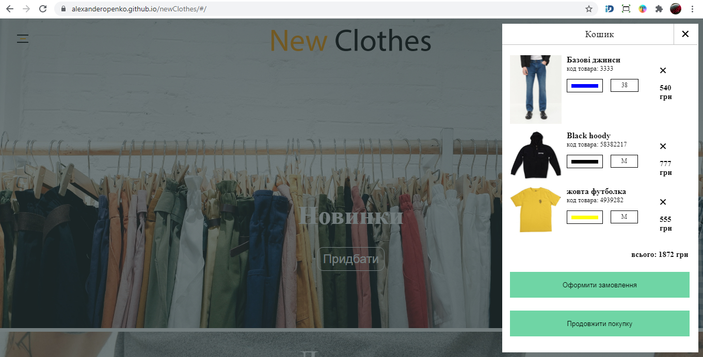
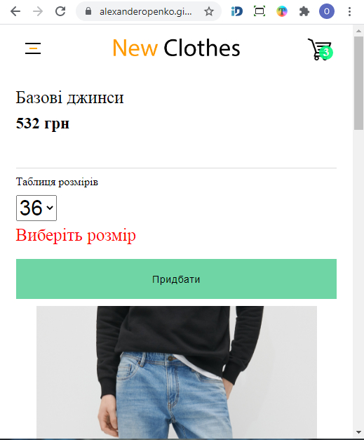
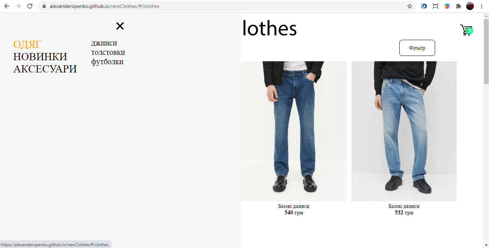

# New Clothes

New Сlothes - это учебный проект интернет магазин. Пользователь может просматривать разные товары, выбирать товар по заданным параметрам фильтра и добавлять товар в корзину. Корзина - это модальное окно в котором пользователь увидит итоговую цену  заказа, количество вещей и их характеристики: цена, цвет, размер, код товара. Если пользователь не укажет размер при выборе товара, то он будет уведомлен, что необходимо выбрать размер.
Корзина сохранит данные если закрыть вкладку с веб-сайтом, и отобразит данные при повторном везите. 
Веб-сайт оснащен отзывчивым дизайном, который адаптируется под мобильные устройства.
На большом экране пользователь видит по 4 элемента товара, а на маленьком по 2.






##  [Демо](https://alexanderopenko.github.io/Project)

# Examples
Несколько примеров кода с описанием
```javascript 
const Page = (props) => {

 let dataObject  = props.photo //ссылка на объект фото из пропсов
let size = dataObject.size 

 let show = (e) => {
//создал независимый клон, копию объекта из пропсов
//чтобы избежать перерисовку компоненты когда измениться объект, изменяем копию
//в этот объект добавиться свойство buySize и объект отправится в корзину
      new Promise ( (resolve) => {
      let clone = Object.assign({}, dataObject) 
      clone.buySize = e.size
      resolve(clone)
    }).then( (data) => props.addElement({data}))
    .then( ()=>  {
      let bulean 
      props.basket ? bulean = false : bulean = true
      props.showBasketAction(bulean) })
    }
    
    return( 
<div className = {s.salePageContent}>
<div className = {s.saleBuy}>
        <div className = {s.info}>
         <div className = {s.name}>{dataObject.info}</div>
        <span className = {s.price}>{dataObject.price} грн</span>
        <div className={s.line}></div>
        <span className={s.tableSize}>Таблиця розмірів</span>
         <PageForm onSubmit={show} size={size}/> 
        </div>
</div>
      <div className={s.salePicts}>  {dataObject.map(p =>{
        return <div className ={s.image}>  
         
        </div> })}
      </div> 
</div> )
 }  
 ```
 Когдa сработает событие onSubit компоненты Redux Form, запуститься функция show которая добавит в объект выбранный размер. Потом сработает функция addElement из Redux-Thunk, в которой объект добавиться в корзину. После этого происходит диспатч экшена в редьюсер из Redux Store для добавления объектов в корзину. Когда измениться стейт корзины то корзина перерисуется.
```javascript
export const addElementToBasket = (prop) => (dispatch) => {

    let elementsBasket;
    let db
    let openRequest = indexedDB.open("tovaru", 1);

    openRequest.onupgradeneeded = function() {
         db = openRequest.result
            if(!db.objectStoreNames.contains('items')) {
                let objectStore = db.createObjectStore('items',{keyPath: 'keys'} ) 
            }  
        }
  openRequest.onsuccess = function () {
        db = openRequest.result
//добавить товар в корзину
    if(prop.data) {
    let transaction = db.transaction('items', 'readwrite')
    let items = transaction.objectStore('items','readwrite')

    let item = prop.data //элемент который нужно добавить

    let key = Math.floor(Math.random() * 20) // генерирую ключ для каждого добавленного объекта
    item.keys = key // добавляю ключ в объект. этот объект отобразится в корзине
    let request = items.add(item)

    request.onsuccess = () => {
        //cоздаю хранилище цены и диспатчу в стор
        if(!localStorage.getItem('totalCount')) {
            localStorage.setItem('totalCount', 0)}

         let addCount = Number(localStorage.getItem('totalCount'))
      
         addCount = addCount + Number(item.price) 
         localStorage.setItem('totalCount', addCount)

        let general = localStorage.getItem('totalCount')
        dispatch(addBaskeTotalPriceAction(general))
    } 
    let requestTwo = items.getAll()

    requestTwo.onsuccess = function () {
        elementsBasket  = requestTwo.result
        dispatch(addElementBasketAction(elementsBasket))
      //длинна масива с объектами в корзине это количество товара
        localStorage.setItem('lengthItems', elementsBasket.length)
        let lengthItems =  Number(localStorage.getItem('lengthItems'))
        dispatch(addElementBaskeSizeAction(lengthItems))
      }   
```
В этом примере создаеться хранилище в indexedDB с объектом 'items' для хранения данных корзины. Добавление и удаление объектов из базы данных осуществляется по ключу 'keys'.
addElementToBasket - функция Redux-Thunk которая в зависимости от входящих пропсов диспатчит нужный экшн. В объект из пропсов прибавится свойство keys с сгенерированным уникальным ключом по которому осуществится удаление объекта из корзины.

```javascript
//отобразить корзину
    if(prop.showBasket) {
    let transaction = db.transaction('items', 'readwrite')
    let items = transaction.objectStore('items','readwrite')
        let ask = items.getAll()  
        ask.onsuccess = function () {
            elementsBasket  = ask.result
            dispatch(addElementBasketAction(elementsBasket))
        localStorage.setItem('lengthItems', elementsBasket.length)
        let lengthItems =  Number(localStorage.getItem('lengthItems'))
        dispatch(addElementBaskeSizeAction(lengthItems))   
    }
      let addCount = Number(localStorage.getItem('totalCount'))
      dispatch(addBaskeTotalPriceAction(addCount))
}
```
Так осуществляется отображение корзины. Из бази данных достаются объекты и диспатчатся в стейт из Redux Store.
Компонента корзины Basket обернутая hoc из Редакс connect, которая передает в корзину из стейта объект с данными. В корзине отрисовываются объекты.
```javascript
if(prop.deleteElem){
    let transaction = db.transaction('items', 'readwrite')
    let items = transaction.objectStore('items','readwrite')
    let deleteElemWithKey = prop.deleteElem.elem //сгенерированный ключ
      
    let remove = items.delete(deleteElemWithKey)
   
    remove.onsuccess = function() {
        
        let request = items.getAll()

        request.onsuccess = function () {
             elementsBasket = request.result 
             dispatch(addElementBasketAction(elementsBasket))}

        let addCount = Number(localStorage.getItem('totalCount'))
  
      addCount = addCount - Number(prop.deleteElem.deletePrice) 
      localStorage.setItem('totalCount', addCount)
     let general = localStorage.getItem('totalCount')
     dispatch(addBaskeTotalPriceAction(general)) 
    }
}
```
Так осуществится удаление элемента корзины по ключу
```javascript
const Header = (props) => {
 
let setElementsBsket = () =>  {
 let lengthItems =  Number(localStorage.getItem('lengthItems'))
 props.addElementBaskeSizeAction(lengthItems)
}

  useEffect ( () => {
    //после того как страница отрендерится сработает юз ефект 
    //чтобы получить из localStorage даные которые несут значение длинны массива с объектами 
    //из корзины(количество товара). Когда число получено, оно диспатчится экшеном в стейт и страница заново
    //рендерится чтобы отобразилось актуальное количество товара в корзине.
    setElementsBsket()}, []
  )
  
  let showBasketPage = () => {   
  
    let bulean
    
    props.basket ? bulean = false : bulean = true
    props.showBasketAction(bulean)

    //экшн который запустит функцию которая получит объекты из IndexedDB 
    //и задиспатчит объекты в редакс стор и отобразит корзину
    props.addElementToBasket({showBasket: true})
  }
    
    return <>
      <div className={s.img}> 
        <NavLink to="/" >
           
       </NavLink>
      </div> 

      <span onClick={showBasketPage}>
         
        {//если размер страници = число и > 0 то отобразится размер корзины
        (typeof(props.basketSize) == 'number' && props.basketSize > 0) ?
        <div className={s.basketSize}>
          {props.basketSize}
        </div>:''}
      </span>

        <span className = {s.bag}>
          {document.body.style.overflowY = `auto`}
        </span>
    
    
    {//если баскет true то отрисуется корзина
    props.basket && <Basket totalCount={props.totalCount} basketElements={props.basketElements}
    showBasketPage={showBasketPage}
    addElementToBasket={props.addElementToBasket}
   />}
</>
} 

let mapStateToProps = (state) => {
    return(
        {
         basket: state.basket.show,   
         basketElements: state.basket.basketElements,
         basketSize: state.basket.basketSize,
         totalCount: state.basket.totalCount
        }
    )
}

export default connect(mapStateToProps, {showBasketAction, addElementToBasket, addElementBaskeSizeAction}) (Header);
```
Когда отрисуется компонента Header сработает useEffect() чтобы получить актуальное количество елементов в корзине. Когда количество получено сработает экшн addElementBaskeSizeAction чтобы изменить в стейт количество товара. После того как стейт изменится в Header в иконке корзины отрисуется актуальное количество товара.
``` javascript
class Clothes extends React.Component {

    componentDidMount() {
        let num = []
         new Promise ( (resolve) => {
          let  clothesPhoto = num.concat(jeansPhoto, newItemsPhoto)
            resolve(clothesPhoto);  
        }).then( data => {this.props.clothesCreator(data)})
        } 

        render(){
            return <PagesContent
            elementsObject={this.props.elementsObject}
            filterType={'clothes'} 
            url={'/clothes/'}
            />
        }
    }
    
    let mapStateToProps = (state) => { 
    
        return ({
            elementsObject: state.contentReducer.clothes, 
        })
    }
    
    export default connect(mapStateToProps,{clothesCreator }) (Clothes)
```
Clothes - это родительская компонента, в которой в методе жизненного цикла componentDidMount() идет запрос на получение объектов с данными товара и диспатчит в стор. Дочерняя компонента PagesContent получает от родителей пропсы с полученными объектами для их отрисовки.

```javascript
export const filterContent = ( prop ) => (dispatch) => {

    let filter;
    let contentFilter;
    let filterSaleError = 'Нажаль за Вашим запитом результатів немає';  

    if(prop.filterType == 'jeans'){contentFilter = jeansPhoto} else if
    (prop.filterType == 'hoody') {contentFilter = hoodyPhoto} else if
    (prop.filterType == 'tshirt') {contentFilter = tshirtPhoto} else if
    (prop.filterType == 'clothes'){contentFilter = clothesPhotoArray} else if
    (prop.filterType == 'new'){contentFilter = newItemsPhoto}

   
    //фильтруется объект в зависимости от вида товара
     filter =  contentFilter.filter(elem =>{
    return elem.info == prop.info && elem.color == prop.color && elem.size.some(el => el === prop.size )
     })
    
     if(filter.length == 0) {
        filter = contentFilter.filter(elem =>{
            return elem.info == prop.info || elem.color == prop.color || elem.size.some(el => el === prop.size )
            
             })
     }
    
    let argumentFilter = filter.length == 0 ? filterSaleError : filter
    //диспатчится экшн в зависимости от вида товара
    if(prop.filterType == 'jeans'){dispatch(jeansCreator(argumentFilter))} else if
    (prop.filterType == 'hoody') {dispatch(hoodyCreator(argumentFilter))} else if
    (prop.filterType == 'tshirt') {dispatch(tshirtsCreator(argumentFilter))} else if
    (prop.filterType == 'clothes'){dispatch(clothesCreator(argumentFilter))} else if
    (prop.filterType == 'new'){dispatch(newItemsCreator(argumentFilter))}
    }
```
filterContent - middleware функция из Redux-Thunk, которая принимает метод dispatch как аргумент, чтобы после фильтрования товара использовать его для диспатчинга экшена. filterContent принимает пропсы с параметрами для фильтрования.
# Getting Started with Create React App

This project was bootstrapped with [Create React App](https://github.com/facebook/create-react-app).

## Available Scripts

In the project directory, you can run:

### `yarn start`

Runs the app in the development mode.\
Open [http://localhost:3000](http://localhost:3000) to view it in the browser.

The page will reload if you make edits.\
You will also see any lint errors in the console.

### `yarn test`

Launches the test runner in the interactive watch mode.\
See the section about [running tests](https://facebook.github.io/create-react-app/docs/running-tests) for more information.

### `yarn build`

Builds the app for production to the `build` folder.\
It correctly bundles React in production mode and optimizes the build for the best performance.

The build is minified and the filenames include the hashes.\
Your app is ready to be deployed!

See the section about [deployment](https://facebook.github.io/create-react-app/docs/deployment) for more information.

### `yarn eject`

**Note: this is a one-way operation. Once you `eject`, you can’t go back!**

If you aren’t satisfied with the build tool and configuration choices, you can `eject` at any time. This command will remove the single build dependency from your project.

Instead, it will copy all the configuration files and the transitive dependencies (webpack, Babel, ESLint, etc) right into your project so you have full control over them. All of the commands except `eject` will still work, but they will point to the copied scripts so you can tweak them. At this point you’re on your own.

You don’t have to ever use `eject`. The curated feature set is suitable for small and middle deployments, and you shouldn’t feel obligated to use this feature. However we understand that this tool wouldn’t be useful if you couldn’t customize it when you are ready for it.

## Learn More

You can learn more in the [Create React App documentation](https://facebook.github.io/create-react-app/docs/getting-started).

To learn React, check out the [React documentation](https://reactjs.org/).

### Code Splitting

This section has moved here: [https://facebook.github.io/create-react-app/docs/code-splitting](https://facebook.github.io/create-react-app/docs/code-splitting)

### Analyzing the Bundle Size

This section has moved here: [https://facebook.github.io/create-react-app/docs/analyzing-the-bundle-size](https://facebook.github.io/create-react-app/docs/analyzing-the-bundle-size)

### Making a Progressive Web App

This section has moved here: [https://facebook.github.io/create-react-app/docs/making-a-progressive-web-app](https://facebook.github.io/create-react-app/docs/making-a-progressive-web-app)

### Advanced Configuration

This section has moved here: [https://facebook.github.io/create-react-app/docs/advanced-configuration](https://facebook.github.io/create-react-app/docs/advanced-configuration)

### Deployment

This section has moved here: [https://facebook.github.io/create-react-app/docs/deployment](https://facebook.github.io/create-react-app/docs/deployment)

### `yarn build` fails to minify

This section has moved here: [https://facebook.github.io/create-react-app/docs/troubleshooting#npm-run-build-fails-to-minify](https://facebook.github.io/create-react-app/docs/troubleshooting#npm-run-build-fails-to-minify)
